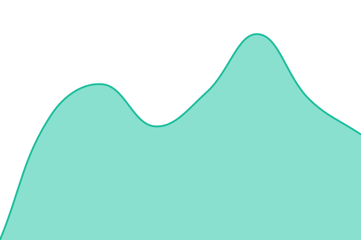
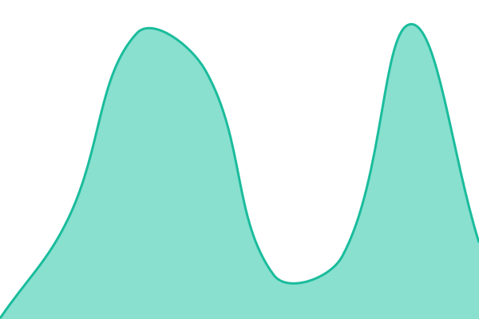
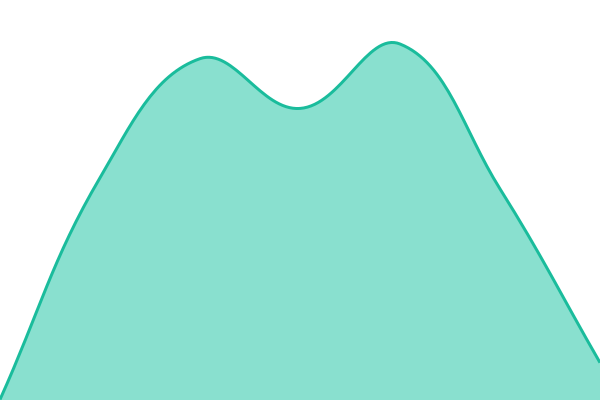
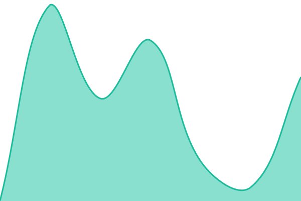

# [📈 Live Status](https://status.saldomat.pl): <!--live status--> **Wszystkie systemy działają**

This repository contains the open-source uptime monitor and status page for [Mateusz](https://status.saldomat.pl), powered by [Upptime](https://github.com/upptime/upptime).

With [Upptime](https://upptime.js.org), you can get your own unlimited and free uptime monitor and status page, powered entirely by a GitHub repository. We use [Issues](https://github.com/monczga/saldomat-status/issues) as incident reports, [Actions](https://github.com/monczga/saldomat-status/actions) as uptime monitors, and [Pages](https://status.saldomat.pl) for the status page.

<!--start: status pages-->
<!-- This summary is generated by Upptime (https://github.com/upptime/upptime) -->
<!-- Do not edit this manually, your changes will be overwritten -->
<!-- prettier-ignore -->
| URL | Status | History | Czas odpowiedzi | Dostępność |
| --- | ------ | ------- | ------------- | ------ |
|  [saldomat.pl](https://saldomat.pl) | 🟩 Up | [saldomat-pl.yml](https://github.com/monczga/saldomat-status/commits/HEAD/history/saldomat-pl.yml) | 

 829ms
     
 | 

<a href="https://status.saldomat.pl/history/saldomat-pl">100.00%</a>
    

|  [Blog](https://saldomat.pl/blog) | 🟩 Up | [blog.yml](https://github.com/monczga/saldomat-status/commits/HEAD/history/blog.yml) | 

 552ms
     
 | 

<a href="https://status.saldomat.pl/history/blog">100.00%</a>
    

|  [RSS feed](https://saldomat.pl/blog/rss.xml) | 🟩 Up | [rss-feed.yml](https://github.com/monczga/saldomat-status/commits/HEAD/history/rss-feed.yml) | 

 473ms
     
 | 

<a href="https://status.saldomat.pl/history/rss-feed">100.00%</a>
    

|  [Lead form API](https://saldomat.pl/api/lead) | 🟩 Up | [lead-form-api.yml](https://github.com/monczga/saldomat-status/commits/HEAD/history/lead-form-api.yml) | 

 369ms
     
 | 

<a href="https://status.saldomat.pl/history/lead-form-api">100.00%</a>
    

|  [Contact form API](https://saldomat.pl/api/contact) | 🟩 Up | [contact-form-api.yml](https://github.com/monczga/saldomat-status/commits/HEAD/history/contact-form-api.yml) | 

 407ms
     
 | 

<a href="https://status.saldomat.pl/history/contact-form-api">100.00%</a>
    

<!--end: status pages-->

[**Visit our status website →**](https://status.saldomat.pl)

## 📄 License

- Powered by: [Upptime](https://github.com/upptime/upptime)
- Code: [MIT](./LICENSE) © [Anand Chowdhary](https://anandchowdhary.com), supported by [Pabio](https://pabio.com)
- Data in the `./history` directory: [Open Database License](https://opendatacommons.org/licenses/odbl/1-0/)
